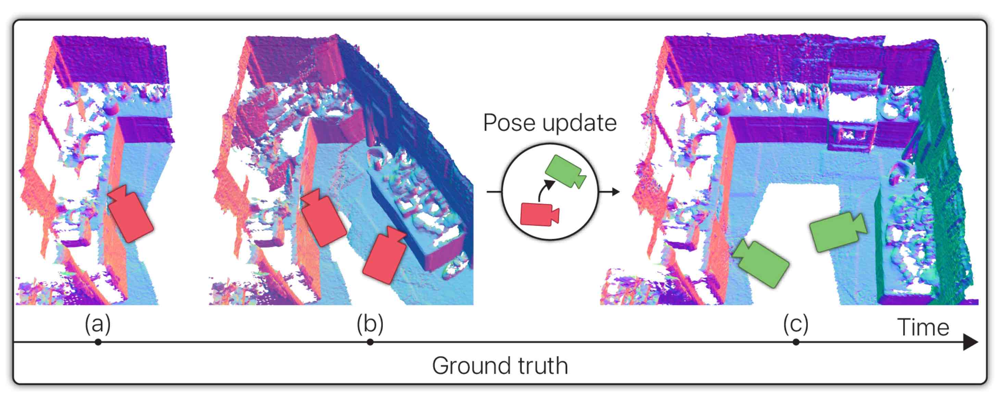

# LivePose

This repository accompanies the research paper, [LivePose: Online 3D Reconstruction from Monocular Video with Dynamic Camera Poses](https://arxiv.org/abs/2304.00054) and contains the data described in the paper.



## Paper

[LivePose: Online 3D Reconstruction from Monocular Video with Dynamic Camera Poses](https://arxiv.org/abs/2304.00054)

Upon using these data or source code, please cite:
```
@inproceedings{stier2023livepose,
      title={LivePose: Online 3D Reconstruction from Monocular Video with Dynamic Camera Poses}, 
      author={Noah Stier and Baptiste Angles and Liang Yang and Yajie Yan and Alex Colburn and Ming Chuang},
      booktitle={Proceedings of the IEEE/CVF International Conference on Computer Vision},
      year={2023},
}
```

## The dataset

The LivePose dataset consists of dynamic pose-tracking data produced by running the [BundleFusion](http://arxiv.org/pdf/1604.01093.pdf) SLAM system on the [ScanNet](http://openaccess.thecvf.com/content_cvpr_2017/papers/Dai_ScanNet_Richly-Annotated_3D_CVPR_2017_paper.pdf) dataset of RGB-D scans. For each ScanNet scene, LivePose contains the BundleFusion pose output stored as an initial pose estimate plus subsequent pose updates for each camera view. The pose updates are grouped into update bundles occurring at approximately 3Hz, where each bundle can contain pose updates for any number of past views.

The dataset contains one text file for each of the 1,613 ScanNet scans. Each line of each file contains a pose estimate formatted as 14 space-separated numbers where the first is the integer index of the frame at which this pose estimate was issued, the second is the integer index of the frame that this pose estimate refers to, and the remaining 12 are the coefficients of the 3x4 camera-to-world transformation matrix in row-major order.

## Download

The dataset can be found at: https://docs-assets.developer.apple.com/ml-research/datasets/live-pose/LivePoseDataset.zip

## License

The LivePose dataset is licensed under the Creative Commons Attribution-NonCommercial-ShareAlike 4.0 International Public License. To view a copy of this license, visit https://creativecommons.org/licenses/by-nc-sa/4.0/.

The third party ScanNet data is made available by ScanNet at http://www.scan-net.org/ and is subject to the ScanNet Terms of Use and ScanNet license. 
